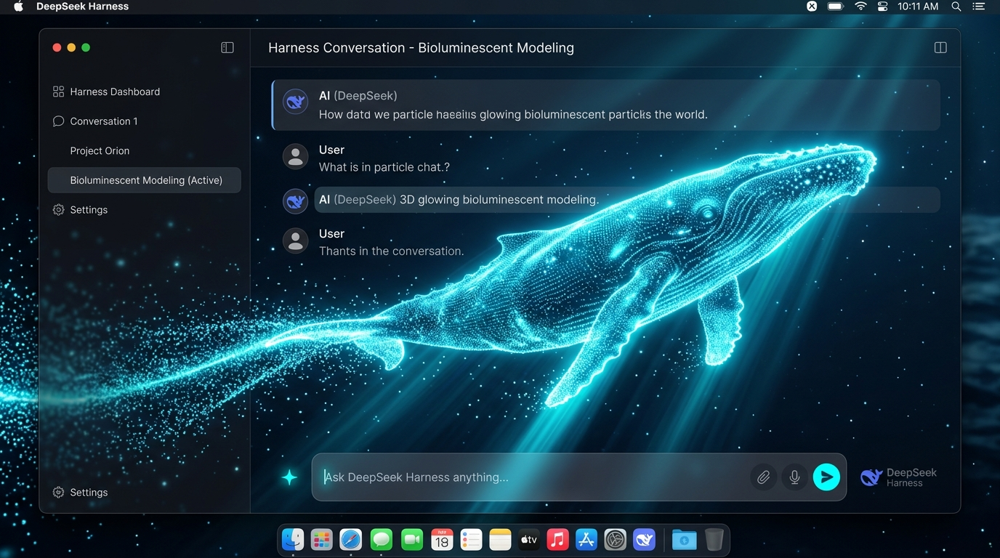

# dsh-particle-whale 🐳

> [English](./README.md) | [简体中文](./README.zh-CN.md)



DeepSeek 官方同款 3D 粒子鲸鱼插件（Three.js WebGL），专为 **DeepSeek Harness (DSH)** 及 **DSH Desktop** 打造。

---

## ✨ 核心特性

- 🌊 **真 3D 纺锤形流线曲面体态**：基于距离场（Distance Transform）与流体力学剖面算法构建的真 3D 粒子巨鲸，具备圆润饱满的腹部、背脊与轻薄尾鳍，翻滚侧倾时立体感极强。
- 💡 **3D 菲涅尔轮廓光照 (Fresnel Rim Lighting)**：每个粒子搭载三维表面法线，呈现动态高光流转与边缘极光辉光。
- 🏊 **仿生前向巡游动力学**：头部领航向前巡游，告别往复晃荡；大半径弧线掉头，伴随如潜艇/海豚般的自然转弯侧倾（Banking Roll）。
- ⚡️ **闲置 vs 思考/工作态模式切换**：
  - **闲置时**：全屏大视野深海漫游（`1.05x` 原始尺寸），尾鳍舒缓摆动；
  - **思考/生成/执行工具中**：**平滑游向右上角并缩小为小灵宠伴随（`0.45x` 迷你尺寸）**，微环形高频游弋，亮起高能青蓝生物电脉冲流光。
- 🌌 **新建会话星云散开重组**：点击“新建会话”（或快捷键 `Cmd+N / Ctrl+N`）时，粒子向全屏星云爆破散开后平滑聚拢重组；日常操作不触发，绝不干扰视线。
- 🪟 **输入栏轻微磨砂半透明**：88% 微透磨砂玻璃（`backdrop-filter: blur(20px)`），鲸鱼游过时在对话框下方若隐若现，且文字清晰可读。
- ☀️ **白天 / 深色主题自适应**：深色模式银蓝发光粒子，白天模式深海高对比宝蓝粒子。
- 🎛 **原生设置面板集成**：注入 DSH Desktop 通用设置面板，支持一键开启/关闭与状态持久化记忆。
- 🚀 **极致性能与无感穿透**：`pointer-events: none` 穿透点击，顶点开销与 GPU 计算经过高帧率优化，支持 60~120 FPS 流畅运行。

---

## 📦 插件目录结构

```text
dsh-particle-whale/
├── package.json          # 插件 npm 元数据与 Cordis 客户端注入声明
├── cordis.patch.yml      # Cordis 插件补丁定义
├── build.mjs             # esbuild 构建脚本（自动内联 Three.js 独立产物）
├── src/
│   └── client.ts         # 前端 WebGL 渲染管线、物理动力学与设置组件源码
├── lib/
│   ├── index.js          # Host 端空入口（纯前端 UI 插件）
│   └── client.js         # 生产编译产物（单文件免外部依赖，内置 Three.js）
├── assets/
│   └── preview.jpg       # 高清效果展示图
├── README.md
└── LICENSE
```

---

## 🚀 安装与启用指南

### 方式一：本地软链接（推荐，开发与即时体验）

1. **进入 DSH Desktop 插件目录**：
   ```bash
   cd ~/Library/Application\ Support/dsh-desktop/harness/profiles/web/node_modules
   ```

2. **创建软链接指向本项目**：
   ```bash
   ln -s /path/to/dsh-particle-whale dsh-particle-whale
   ```

3. **在配置文件中注册插件**：
   打开 `~/Library/Application Support/dsh-desktop/harness/profiles/web/package.json`，在 `dependencies` 和 `dsh.profile.bundles` 中加入 `"dsh-particle-whale"`：
   ```json
   {
     "dependencies": {
       "dsh-particle-whale": "*"
     },
     "dsh": {
       "profile": {
         "bundles": [
           "dsh-particle-whale"
         ]
       }
     }
   }
   ```

4. 打开或刷新 **DSH Desktop** 即可立即体验！

---

### 方式二：npm 安装

```bash
cd ~/Library/Application\ Support/dsh-desktop/harness/profiles/web
npm install dsh-particle-whale
```

---

## 🛠 本地开发与重新构建

```bash
cd dsh-particle-whale
npm install
npm run build
```

---

## 📄 开源协议

[MIT License](./LICENSE) © 2026
